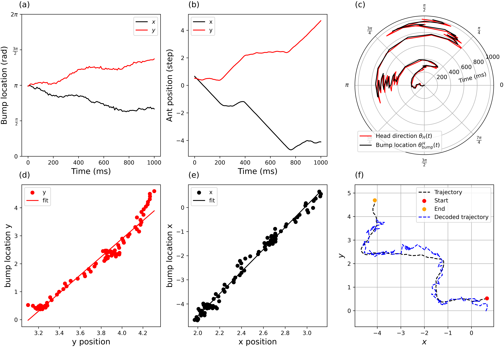

# NX-465 - Bump Attractors
NX-465 Mini-project 2 : Path Integration using Coupled Bump Attractors.

Ants and various other animal species can navigate back to their nest after foraging trips without depending on visual cues. This ability, known as **path integration**, involves maintaining an internal estimate of the relative position of their nest while moving. It is essential for this memory mechanism to be capable of rapid updates while reliably maintaining its state over an extended period. A prevalent theory regarding the neural substrate of this memory suggests that the information is preserved in a bump attractor’s state. Bump attractors are recurrent neural networks that preserve a localised peak of neural activity. They can encode an agent's spatial position by representing it as the position of this 'activity bump' within the network. To verify this hypothesis, we have simulated this process by implementing a neural circuit that integrates the ant's movements in two dimensions to continuously estimate its current position. 

The project is structured in the following files: \
`0_poisson_neurons.ipynb`: behavioural analysis of unconnected poisson neurons \
`1_bump_attractor.ipynb`: exercises related to recurrent networks of poisson neurons \
`2_integration.ipynb`: introducing and analysing coupled bump attractors (two interacting recurrent networks) \
`3_path_integration.ipynb`: testing the coupled bump attractors on the path integration task \
`src/PoissonNeuron.py`: implementation for single population networks\
`src/TwoPopulationSimulation.py`: implementation for two population networks\
`src/simulation.py`: contains useful functions related to bump attractor simulations \
`src/constant.py`: file with all the constants used for the experiments

### Results
Simulation of the activity of the network for the
whole trajectory. Parameters : N=300, Jhead = 1.75 pC.(a) Mean bump location of the right and left populations in the two position integrators over time. (b) x and y position of the ants over time. (c) Bump Location θbump and Current Head Direction θH in Head Direction Cells Simulation. (d)(e) Bump location as a function of the position and its
linear fit. (f) Decoded and original trajectory.

